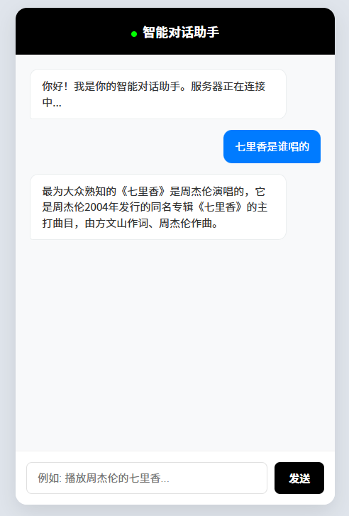

# 智能座舱多轮对话Agent

基于大语言模型的智能座舱多轮对话系统，支持任务型对话、闲聊百科、拒识处理等功能。

## 功能特性

- 多轮对话管理
- 意图识别与槽位填充
- 任务型对话与闲聊切换
- 拒识处理与相关性判断
- 流式响应输出

## 环境要求

- Python 3.7+
- Redis 6.0+
- 依赖库见 `requirements.txt`

## 快速开始

### 1. 环境配置

配置环境变量（参考 `config/config.ini`）：

```bash
export API_KEY="your_api_key"
export BASE_URL="your_base_url"
export AMAP_MAPS_API_KEY="your_map_api_key"
model = "your_model_name"
```

### 2. 安装Redis

```bash
# 下载并编译Redis
wget http://download.redis.io/releases/redis-6.0.8.tar.gz
tar -xzvf redis-6.0.8.tar.gz
cd redis-6.0.8
make -j 10
cd ..

# 启动Redis
./redis-6.0.8/src/redis-server
```

### 3. 安装依赖

```bash
pip install -r requirements.txt
```

### 4. 启动服务

```bash
bash server.sh
```

服务启动后会依次启动：
- 拒识服务（端口8007）
- 意图识别服务（端口8008）
- 大模型推理服务（端口8009）
- 入口服务，系统的对外接口，客户端通过WebSocket连接与之交互（端口8080）

### 5. 启动前端

打开 `index.html` 文件即可开始对话。

前端运行示例：



## 注意事项

- 训练数据集与测试数据集不公开，需自行构建
- 配置文件中的API密钥与URL需要替换为实际的密钥与URL
- Redis需要保持运行状态
- 提示词长度：如果服务器网络环境不支持太长的数据传输，需要适当缩减提示词长度，避免网络传输超时或失败